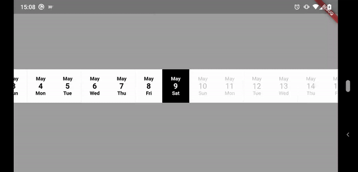

# horizontal_date_picker

A flutter widget provides a horizontal date picker and always aligns selected date in center of the widget.

## Usage

This shows Widget's full customizations:
```
HorizontalDatePickerWidget({
    @required this.startDate,
    @required this.endDate,
    @required this.selectedDate,
    @required this.widgetWidth,
    @required this.datePickerController,
    this.dateItemComponentList = const <DateItem>[
      DateItem.Month,
      DateItem.Day,
      DateItem.WeekDay
    ],
    this.width = 60,
    this.height = 80,
    this.onValueSelected,
    this.normalColor = Colors.white,
    this.selectedColor = Colors.black,
    this.disabledColor = Colors.white,
    this.normalTextColor = Colors.black,
    this.selectedTextColor = Colors.white,
    this.disabledTextColor = const Color(0xFFBDBDBD),
    this.monthFontSize = 12,
    this.dayFontSize = 18,
    this.weekDayFontSize = 12,
  })
```

1. startDate and endDate are required to control the valid date range.
2. selectedDate is to indicate the default selected date.
3. widgetWidth is the whole widget width
4. width and height is the size of each date option item widget.
5. dateItemComponentList is to indicate the date item label to show and the sequence of each label from top to bottom.
6. onValueSelected is the callback function when user selected a new date.
7. normalColor, selectedColor and disabledColor are the background color of each date option item widget background.
8. normalTextColor, selectedTextColor and disabledTextColor are the background color of each date option item widget font color.
9. monthFontSize, dayFontSize and weekDayFontSize are the fontsize of the date item label.

## Example



```
import 'package:flutter/material.dart';
import 'package:horizontal_date_picker/datepicker_controller.dart';
import 'package:horizontal_date_picker/horizontal_date_picker.dart';

void main() => runApp(MyApp());

class MyApp extends StatelessWidget {
  // This widget is the root of your application.
  @override
  Widget build(BuildContext context) {
    return MaterialApp(
      title: 'Flutter Demo',
      theme: ThemeData(
        primarySwatch: Colors.blue,
      ),
      home: TestPage(),
    );
  }
}

class TestPage extends StatefulWidget {
  @override
  _TestPageState createState() => _TestPageState();
}

class _TestPageState extends State<TestPage> {
  @override
  Widget build(BuildContext context) {
    var now = DateTime.now();
    return Center(
      child: HorizontalDatePickerWidget(
        startDate: now.subtract(Duration(days: 14)),
        endDate: now,
        selectedDate: now,
        widgetWidth: MediaQuery.of(context).size.width,
        datePickerController: DatePickerController(),
        onValueSelected: (date) {
          print('selected = ${date.toIso8601String()}');
        },
      ),      
    );
  }
}
```

## License

MIT